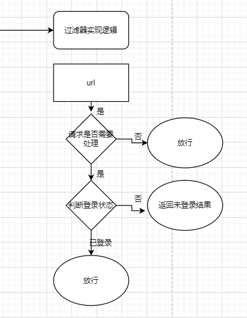
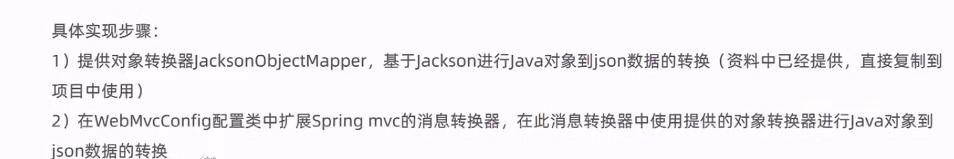

# 员工登录


# 员工管理

> 当前分支user_manager

## 1.解决能直接访问localhost:8080/backend/index.html的问题

过滤器实现



```java
/**
 * 检查用户是否已经完成登录
 */
@WebFilter(filterName = "loginCheckFilter",urlPatterns = "/*")
@Slf4j
public class LoginCheckFilter implements Filter{
    //路径匹配器，支持通配符
    public static final AntPathMatcher PATH_MATCHER = new AntPathMatcher();

    @Override
    public void doFilter(ServletRequest servletRequest, ServletResponse servletResponse, FilterChain filterChain) throws IOException, ServletException {
        HttpServletRequest request = (HttpServletRequest) servletRequest;
        HttpServletResponse response = (HttpServletResponse) servletResponse;

        //1、获取本次请求的URI
        String requestURI = request.getRequestURI();// /backend/index.html

        log.info("拦截到请求：{}",requestURI);

        //定义不需要处理的请求路径
        String[] urls = new String[]{
                "/employee/login",
                "/employee/logout",
                "/backend/**",    //页面可以看，看不到动态数据就行
                "/front/**"
        };


        //2、判断本次请求是否需要处理
        boolean check = check(urls, requestURI);

        //3、如果不需要处理，则直接放行
        if(check){
            log.info("本次请求{}不需要处理",requestURI);
            filterChain.doFilter(request,response);
            return;
        }

        //4、判断登录状态，如果已登录，则直接放行
        //因为是判断session，测试时注意删除cookie
        if(request.getSession().getAttribute("employee") != null){
            log.info("用户已登录，用户id为：{}",request.getSession().getAttribute("employee"));
            filterChain.doFilter(request,response);
            return;
        }

        log.info("用户未登录");
        //5、如果未登录则返回未登录结果，通过输出流方式向客户端页面响应数据
        response.getWriter().write(JSON.toJSONString(R.error("NOTLOGIN")));
        return;

    }

    /**
     * 路径匹配，检查本次请求是否需要放行
     * @param urls
     * @param requestURI
     * @return
     */
    public boolean check(String[] urls,String requestURI){
        for (String url : urls) {
            boolean match = PATH_MATCHER.match(url, requestURI);
            if(match){
                return true;
            }
        }
        return false;
    }
}
```

2.实现员工添加

3.完善异常处理器

4.员工信息分页查询

分页配置类+分页查询方法

5.禁用、启用员工账号

问题：js对long形数据处理丢失精度，导致提交的id和数据库的id不一致

